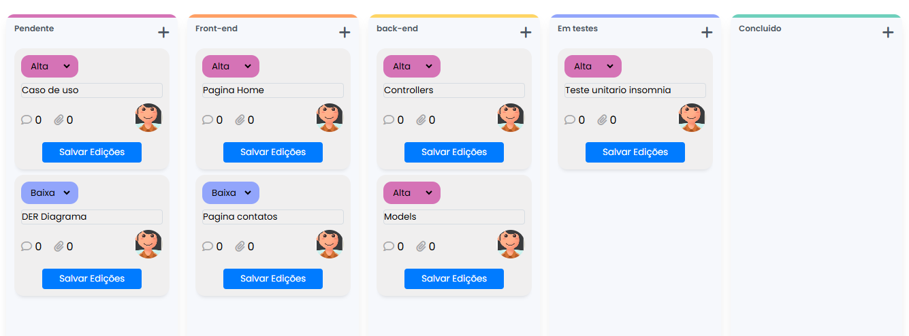

# 📝 Kanban Board - Gerenciador de Tarefas Dinâmico

Bem-vindo ao **Kanban Board**, um aplicativo web dinâmico que permite organizar tarefas de forma visual, prática e interativa. 🚀

## 🖥️ Demonstração

👉 Confira o projeto aqui https://github.com/denilsonferreiradearaujo/KANBAN-HTML-CSS-JS

## 🛠️ Funcionalidades

- **Criar Tarefas**: Adicione novos cards com título e prioridade.
- **Modal**: Adicione seu novos cards ao clicar no plus "+" para abrir uma nova tela (moldal).
- **Editar Cards**: Atualize o título e a prioridade diretamente no card.
- **Arrastar e Soltar**: Mova tarefas entre colunas de forma intuitiva.
- **Salvamento Automático**: Os dados são armazenados no `localStorage` e permanecem mesmo após atualizar a página.
- **Notificações**: Feedback visual com `Toastify` para ações como salvamento de edições ou erros.

## 🚀 Tecnologias Utilizadas

- **HTML5**: Estrutura semântica.
- **CSS3**: Estilização moderna e responsiva.
- **JavaScript (ES6)**: Manipulação do DOM e lógica de aplicação.
- **Toastify.js**: Notificações customizadas.
- **LocalStorage**: Persistência de dados no navegador.

## 📸 Capturas de Tela




## 📂 Estrutura de Arquivos

```plaintext
📦 kanban-board
├── 📁 src
│   ├── 📁 images
│   │   └── avatar-feminino-1.png
│   └── style.css
├── index.html
├── script.js
└── README.md
```

## 🧠 Aprendizados

- Domínio de eventos de **Drag and Drop** no JavaScript puro.
- Persistência de dados no navegador usando **LocalStorage**.
- Melhorias na experiência do usuário com feedback visual.
- Criação de interfaces dinâmicas e responsivas.

## 🔧 Como Executar o Projeto

1. Clone o repositório:
   ```bash
   git clone https://github.com/denilsonferreiradearaujo/KANBAN-HTML-CSS-JS
   ```

2. Navegue até o diretório do projeto:
   ```bash
   cd kanban-project
   ```

3. Abra o arquivo `index.html` no navegador:
   - No Windows, Linux ou MacOS: Clique com botão direito use um servidor local como `Live Server` no VS Code.

## 🤝 Contribuições

Contribuições são sempre bem-vindas! Sinta-se à vontade para abrir uma issue ou enviar um pull request.

## 📣 Contato

Se tiver dúvidas ou sugestões, sinta-se à vontade para entrar em contato:

- **LinkedIn**: [Denilson Araujo](www.linkedin.com/in/denilson-araujo-686aa9168)
- **E-mail**: denilson.ferreiradearaujo@gmail.com

---

⭐ **Se você gostou do projeto, não esqueça de dar uma estrela no repositório!** ⭐
